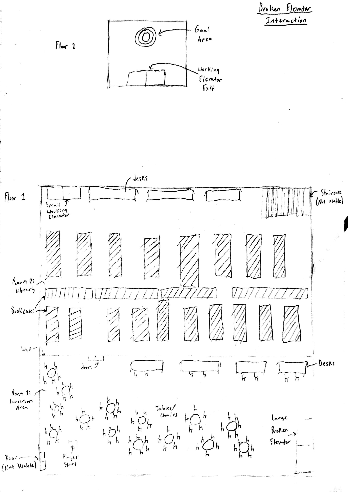
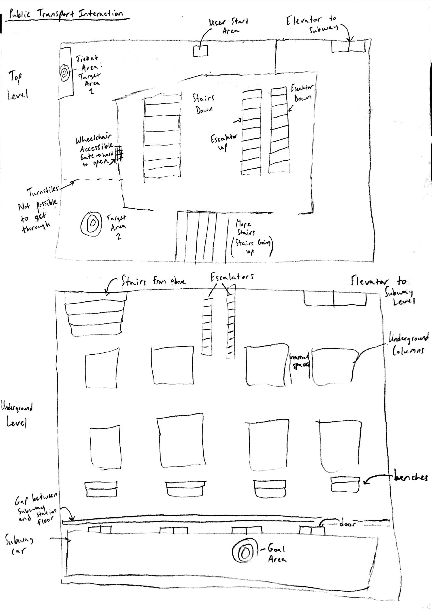
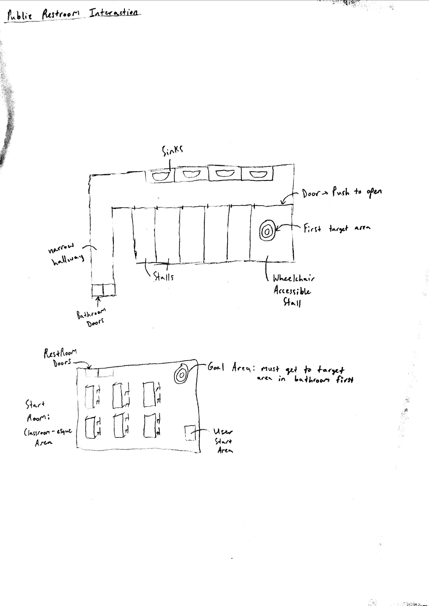
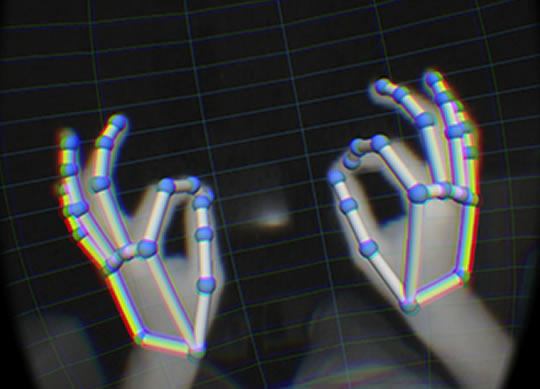
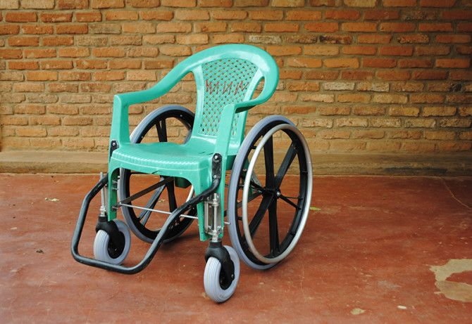

<nav class="main-nav">
  <ul>
    <li><a href="/vrcapstone19sp-team5">Updates Blog</a></li>
    <li><a href="/vrcapstone19sp-team5/proposal">Proposal</a></li>
    <li><a href="/vrcapstone19sp-team5/PRD">PRD</a></li>
  </ul>
</nav>

# Week 5 - Demos and Expensive Bike tires
## May 3rd, 2019

We finally managed to put together the chair at last!


The wheels were a lot more expensive than we thought, totallying to about $120 for the two of them. The chair cost $2. This week we mostly were coding and modeling our scenes. Later today we plan to meet up with a manual wheelchair user to get their thoughts on our plans for the experience.

We're still facing the bug featuring rotation of the wheels, but I (Ilya Kucherov) have a few ideas on a solution.

Primarily, I'd like to construct a holder for the controller that will be duct taped to the wheel. This will let me just put the controller in and take it out whenever I want. Ideally, the box would be oriented in such a way as to align the orbitals of the controller along the x-axis. Essentially, when I spin it, I want the controller's rotation to go from 0 to 360 rather than making the weird negative and positive number leaps it enjoys. If I orient it properly, rather than taking the relative rotation between frames, I can just hook up the wheel directly to the change in x-axis rotation for the controller. Of course, I'd need to convert the negative rotation values to positive. Euler angles seem to not work for some reason, so this is a hopeful solution - just orienting the controller properly to create the proper axis so that we can FINALLY get a live demo working.

```
[ERROR/MISSINGVIDEO/libraryScene.mp4]
```

As mentioned earlier, we've done some great work featuring the scenes. The above showcases the basic library scene that we're considering.

We've also finally gotten started on messing with LeapMotion. We're using the code of Operator 1983, a previous capstone project, that created physical representations of the hands and allowed them to actually interact with things in the environment. Instead of just fingertips, the whole hand will have a constantly shifting hitbox. Things should go well on this front, but we're still figuring things out. Our current VR Headset has the leapmotion camera superglued to the front, meaning we get an experience without controllers, which is what we're going for with the whole wheelchair experience.

Motion sickness is still a threat, but we can't deal with that until we get our wheelchair rotation working.

As a general update for the team members and what we plan to do in the future:

Ilya: Working on physical wheelchair-virtual wheelchair mapping
Luke: Working on making leap motion interactions in the VR scenes
David and Kyle: working on the bathroom interaction and the finishing touches of the library interaction, general scene planning.

# Week 4 - Wheelchair Progress and Environments
### April 26th, 2019

This week we made some real progress in translating the rotation of the controllers into the rotation of the wheels on a wheelchair.

<video controls="controls">
  <source type="video/mp4" src="img/Week4.mp4"></source>
  <p>Your browser does not support the video element.</p>
</video>

One of the major bugs we're facing on this front at the moment is rotation in regards to the X axis. The movement of the wheels is being determined by the difference in Quaternion rotation positions every frame and then having that difference accessed by another script to divide it by delta time:
```
void Update()
    {
        orientation1 = orientation2;
        orientation2 = gameObject.transform.rotation;

        Quaternion relative_rotation = Quaternion.Inverse(orientation1) * orientation2; // difference between quaternions

        relative_rotation.ToAngleAxis(out degree, out axis);

        if (axis.y < 0) //backwards rotation
        {
            degree *= -1; //will make degree appear backwards for force conversion
        }


    }
```
This has the unfortunate side effect of taking only the rotation of the controllers relative to the ground. While this is enough to get us off the ground, we still need to smooth out the movement and get the actual rotations working. We plan to do so by averaging the movement of 5 frames, but that's getting ahead of ourselves.

As before, the plan remains to acquire a real chair and bike wheels, and rig it with some kind of material underneath the tires to provide resistance, much like a still exercise bike. While we have movement, we're still working out the kinks.

On the environment side, we've actively planned out at least 2 of our three scenarios. One of the scenarios will involve the culmination of several things: First, you're in a restaurant. Having spent all day turning dirty wheels, your hands are pretty messy. This should get one of the messages across. Upon arriving at the restroom, you'll find that you can barely see yourself in the mirror, due to your sitting position. Furthermore, after washing your hands, you'll find it incredibly hard to leave the bathroom, having to coordinate an 8-point turn just to leave the bathroom due to the narrow hallway design common in most areas.





For our next scenario, we plan to have an elevator that's usually available broken, forcing you, in your wheelchair, to navigate across a troublesome indoor environment (one of the CSE buildings perhaps) in order to reach the other elevator across the building. We're specifically trying to make as hostile an environment as possible.

Our last scenario features public transport, although we're still working on that one.

We have been experimenting with some interactable elements of the environments. Here is a short video demo of an automatic door
that stays open for 5 seconds, which might be too short for wheelchair users.

<video controls="controls" width="640" height="480">
  <source type="video/mp4" src="img/autodoordemo.mp4"></source>
  <p>Your browser does not support the video element.</p>
</video>

On the topic of motion sickness, we've actually found that there isn't all that much to be had. The speed of the wheelchair and the natural physical feedback you get by spinning the controllers counteracts a fair amount of it. This will be mitigated even more by actual wheels keeping the controllers steady.

This next week is going to mostly be working out the kinks of the wheelchairs and hopefully getting a physical prototype working, and putting the wheelchair into an actual environment.

---
# Week 3 - Wheelchair Controls and Environment
### April 18th, 2019

One of the big centerpieces of our project is the controls. It's easy enough to just create a VR environment and everything, apply textures, scale a few doors, script a few elevators, but ultimately, our project comes down to the user experience of using an real(read: fake) wheelchair to really experience what it's like to be disabled in the modern world.

We've primarily decided to use a combination of the Windows Mixed Reality headset and Leap Motion, a device that tracks your hands. With some help, we hope to implement a customized interaction system to allow the hands to actually interact with things in the environment, rather than just the finger tips.



Our idea is to strap the controllers to the center of each wheel on the real-life wheelchair, and when the person spins the wheels, the controllers spin. Their rotation can be directly translated into forwards motion in the virtual environment. Essentially, we are technically working controller free.

We decided on using the Leap Motion over just the controllers because of a couple of reasons: If we used only one controller for the wheels and kept a controller for interaction, we would lose the ability to turn the wheelchair (rotating only one wheel). If we used the controllers to turn the wheel and also interact with things, whenever the person wanted to move around in the wheelchair, they'd have to put the controllers in their lap, which is a horrible user experience. By combining the Leap Motion and the controllers, we hope to create a really accurate and physical experience for the user. This is all to drive home the difficulties of using a wheelchair.

A problem that we're going to continue to run into is motion sickness. This is the biggest problem for our entire project: movement without physical feedback/stimuli. We're attempting to tackle this as best we can, to make the user feel as if they're really in a wheelchair, to provide as much physical feedback to their motions in game as we possibly could.

As a last note to mention: The Mixed Reality Headset can't actually track controllers that are outside of a certain range. One might think this is a problem: If the controllers aren't tracked, then how will the wheels turn? This is solved by the inherent properties of the controllers. They're connected to the computer via Bluetooth, and still report their orbitals at all times. Even if the controllers are outside of effective range, the system can still detect them spinning! All we have to do is make the model invisible and we're in business.

This next week is mostly going to be attempting to test how bad the motion sickness is and trying to get ahold of bike tires and old chairs.

---
# Week 1/2 - Main Ideas and Plans
### April 12th, 2019

This week we managed to come to a consensus on what we want our main project to be and did massive planning on basic interactions and ideas.

We've decided to focus on an Educational/Empathy based experience, where the user will go through the daily life of someone who is disabled, namely, in a wheelchair.

In doing so, we hope to create a sense of empathy for the disabled, and possibly inspire the user to create a more welcoming environment for the disabled, such as advocating ramps, etc., having experienced a small fraction of what life is like for them.



A key part of the experience will be rigging a chair, seen above, to be a wheelchair, where we'll attach the motion controllers to the sides of the wheel.

The user will constantly have to turn the wheels of the chair to be able to move around in the virtual environment, which helps add enormous authenticity to the experience. The chair will be elevated slightly to prevent it from actually moving when they turn the wheels, and straps will be attached from the wheels to their wrists to create the illusion of resistance (otherwise they'd be spinning the wheels in midair). This will also physically exhaust the user, which also helps build empathy as they're experiencing the same exhaustion an actual disabled person would experience from rolling around in a wheelchair all day.

The user will have to navigate through an area on this virtual wheelchair. Obviously, this environment will be specifically designed to be inconvenient, such as disabled elevators and the like. Staircases will be blocked off, and numerous other precautions taken. It's likely that we'll model the virtual environment after the CSE building, or perhaps a simplified version of downtown Seattle.
