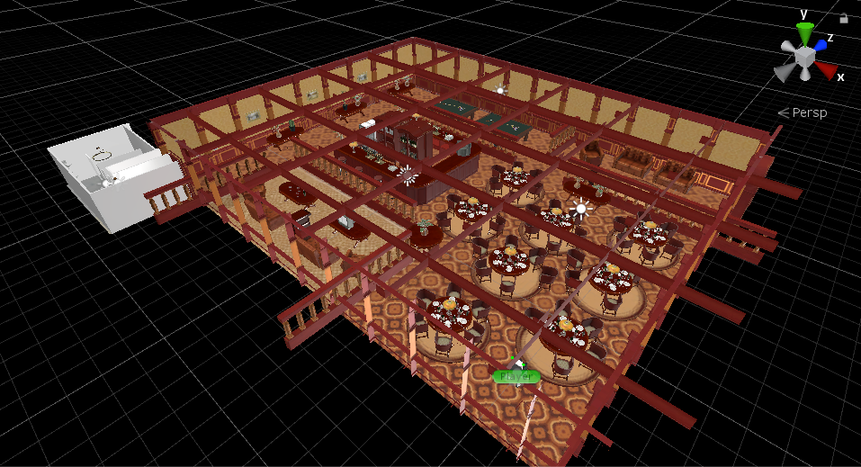
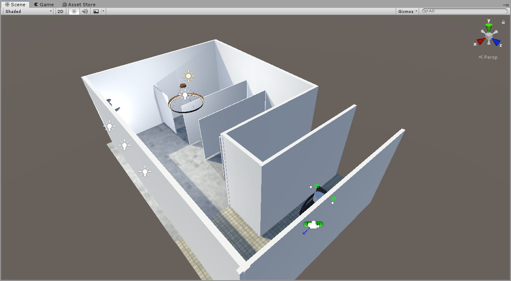
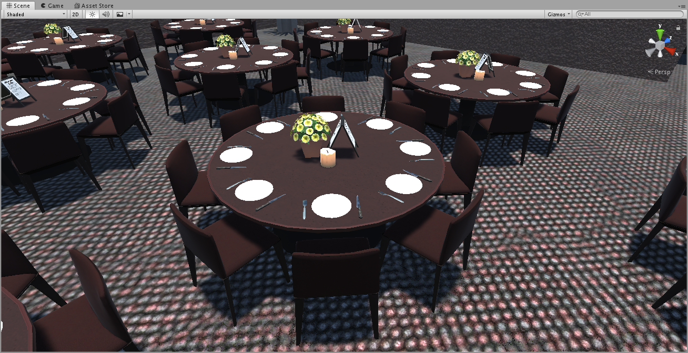
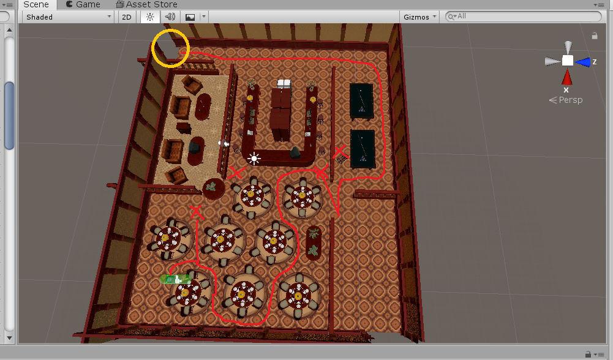
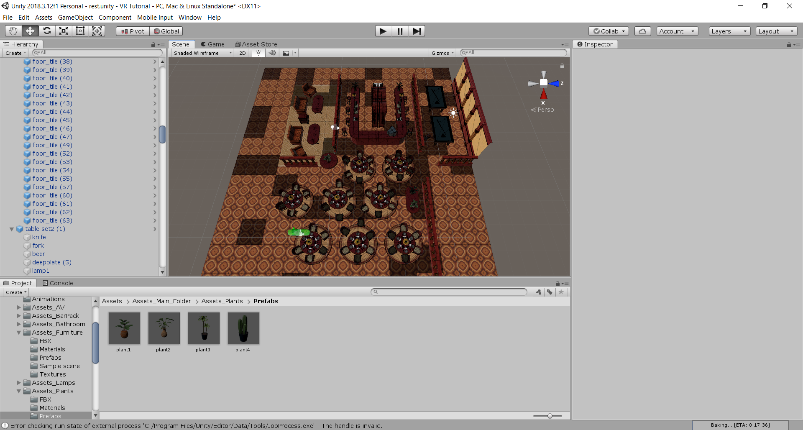
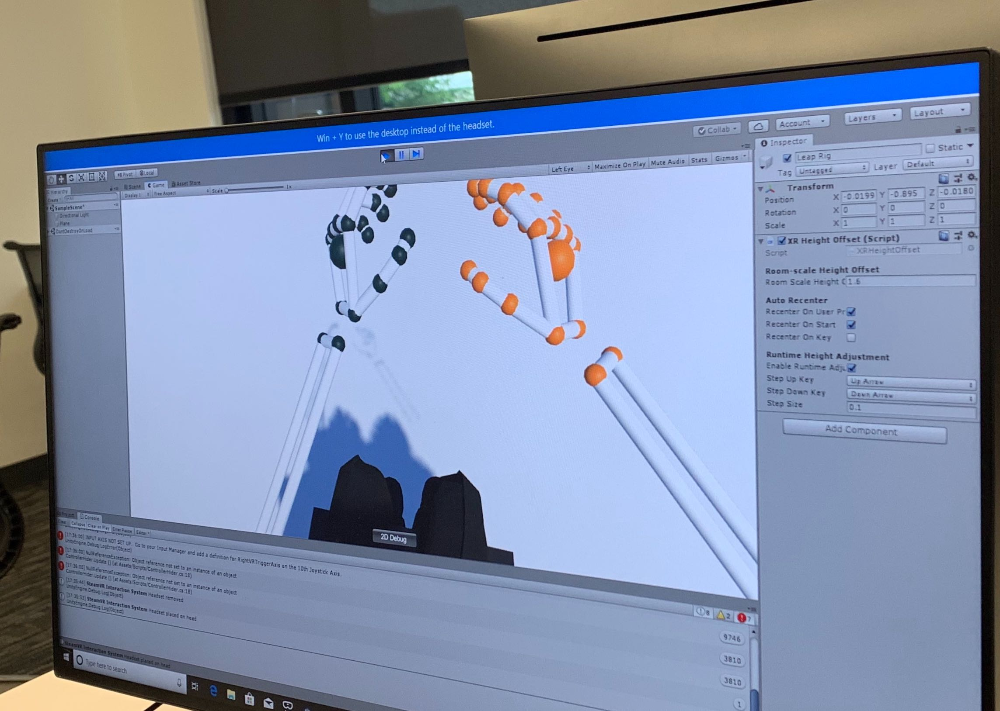
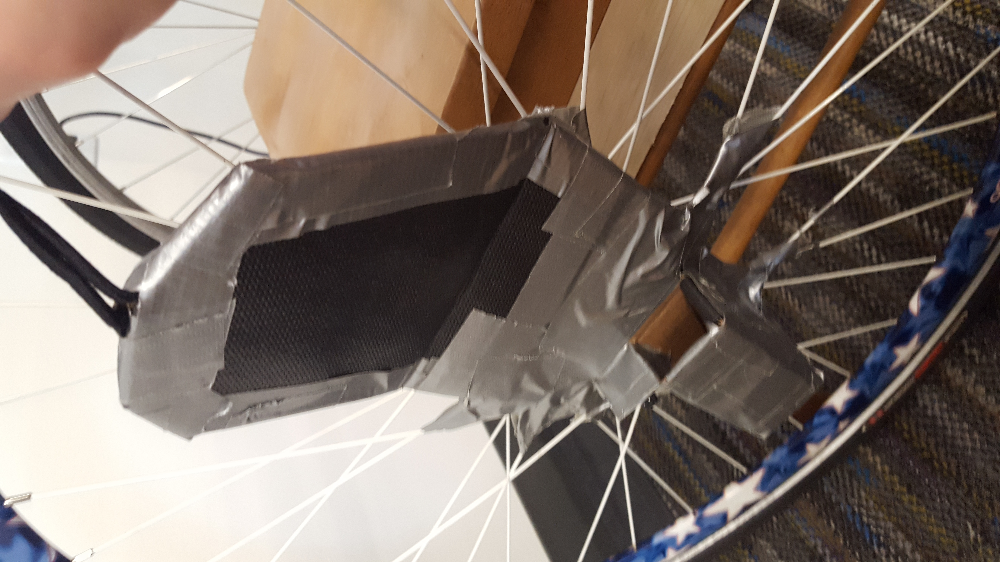
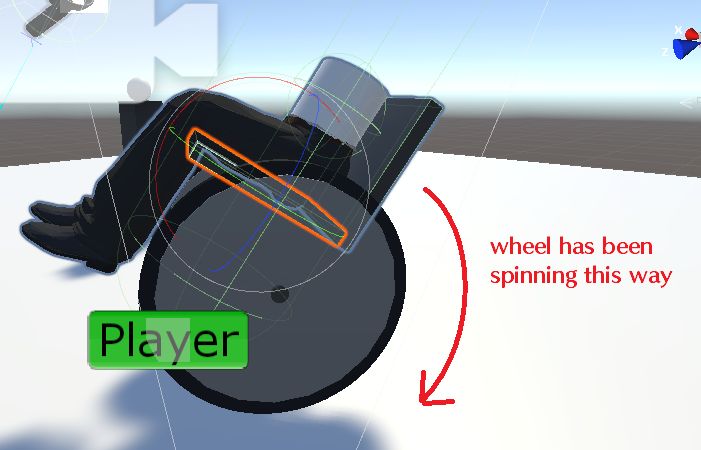

<nav class="main-nav">
  <ul>
    <li><a href="/vrcapstone19sp-team5">Updates Blog</a></li>
    <li><a href="/vrcapstone19sp-team5/proposal">Proposal</a></li>
    <li><a href="/vrcapstone19sp-team5/PRD">PRD</a></li>
  </ul>
</nav>

# Week 10 - Small Touch Ups
## June 7th, 2019

We're basically done here. Demo day is coming up on Tuesday, and we've got most if not all of the thing done. All that's left is to fix the lighting in the library, and adjust a couple of values and settings, along with some other small stuff.

Due to the small amount of things we have left to do, this blog post probably won't be as long as the others.

Luke mostly worked on getting the LeapMotion hands to have a different appearence:
This week I worked on getting the leap motion hands to appear as actual human hands rather than skeleton hands. This mostly involved reading leap motion documentation and finding the appropriate skin that we wanted to use for the hands. The problem was that the human hands would not show up in-game when trying to replace the skeleton hands. After solving this issue by having the hand model top level object recognize the new hands, the hands that were selected appeared as outlines rather than actual hands. This eventually was fixed by finding the appropriate prefab in the Leap Motion assets folder and having the hand model top level object recognize that prefab, then tinkering with some of the tags to get the leap rig to recognize the hand movement.
After getting the hands to look correct, I tested our leap interactions in our scenes to make sure this change didn’t break anything.

David and Kyle worked mostly on sound design: This week we (David and Kyle) added some final touches to the environments by adding music. Adding music was easy --- just adding an audio source object to the scene and set it to “Play on awake” and “Loop” makes the music loop nicely in the background. We also added auditory feedback when the user bumps into something else (basically just a quick bump sound.)
We added an audio source to the wheelchair, and used a script on all child game objects of the wheelchair with a collider to call `Play` on the wheelchair’s audio source:
```
// children with colliders
public class WheelchairCollisionSoundChild : MonoBehaviour
{
    public float collisionSpeedThreshold = 0.5f;
    private void OnCollisionEnter(Collision collision)
    {
        if (collision.relativeVelocity.magnitude > collisionSpeedThreshold && !collision.collider.gameObject.CompareTag("FloorTiles"))
        {
            wheelchair.PlayCollisionSound();
        }
    }
}

// parent
public class WheelchairCollisionSound : MonoBehaviour
{
    private AudioSource audioSource;

    // Start is called before the first frame update
    void Start()
    {
        audioSource = GetComponent<AudioSource>();
    }

    public void PlayCollisionSound()
    {
        audioSource.Play();
    }
}
```
We are still in the process of finalizing the elevator so the visual effects look consistent. We expect it to be perfectly working by the demo day. The idea is that creating an audio feedback will help with motion sickness and just general quality of life.

Ilya had a surprisingly busy week: I was actually dealing with way more stuff than I thought. Having tested our handiwork a week prior, I set out on getting rid of as much motion sickness as possible. The first was completely redesigning the wheelchairs. This involved using Single Speed wheels instead of Geared Wheels, which let me actually secure them properly to the chair. The wheels now move at roughly the same speed, and the movement is smoother in game as a result.

I also reduced the Field of View of the VR camera. There have been studies that show the FOV being reduced helps alleviate some motion sickness, and reducing it even more while turning would be great. Unfortunately, I don't really have a clue how to have a dynamically changing texture that depends on the speed of a turn. It's a stretch goal.

The VR camera has a hardcoded field of view of 102 degrees. You can't mess with it. So the solution was just to teleport a box with a black texture that has a transparent circle on it directly in front of the camera. This helped create the illusion that the field of view shrank. You can see the cube directly on top of the Player object below:


Furthermore, I've implemented windows along the walls of the restaurant as seen above. Something that was recommended to me was to let the player see the Skybox. This helped create the illusion of an open space, as well as establishing a horizon line.

Another thing I've messed with was making the wheelchair movements smoother, by having both wheels track only one controller when both wheels are moving in the same direction (indicating they're going forward). Rather than have a slightly tilted and jerky motion due to the precise nature of the controllers, we now have a smooth forwards movement. This unfortunately, has one small bug: there's a small jitter at the end of a movement, as one wheel stops half a second before the other in real life. Since I have some code that sets the speed to 0 if the change in degrees of the wheel is too small, what happens is:
```
L: 15 R: 15
L: 15 R: 0
L: 0 R: 0
```
Where the left wheel turns for that extra half second while the other wheel is forced to a stop. This causes a small mini turn at the end of a motion, which is quite annoying and possibly causing motion sickness. But this is all better than what we had before. This is also easily mitigated by having the player manually stop themselves, just grabbing on to the wheels like a regular person. This bug only shows up if you throw the wheels forward and don't touch them.

All that's really left is to implement a few quick things, like goal points, and sounds, and some other junk. We're pretty much done here.

That's really it for us. It was a pleasure doing this capstone project. Thank you for the opportunity.

# Week 9 - Approaching endgame
## May 31th, 2019

We've managed to deal with the previously annoying setback and revealed a whole bunch of other small ones which may have a lasting impact. The second to last week is very much not the time for this sort of thing.

Luke has mostly been dealing with LeapMotion:
This week I worked on working out the kinks of the leap motion bugs I was encountering last week. There was a recurring problem in the library that involved the leap hands not interacting well with the wheelchair wheels. This happened in a seemingly random manner (sometimes it happened, other times it did not. The only way to reproduce the behavior was to move into and out of the elevator, but it sometimes occurred even if the player did not perform that specific action). This bug was likely related to the problems encountered last week with the leap hands colliding with the wheels, something that was seemingly fixed but popped up occasionally. After reading into leap motion and how it handles collisions a bit more, I tried moving the interactions manager to a different position in our wheelchair hierarchy. This seemed to solve both the problems! However, it created a slightly new problem with the wheels and the hands moving slightly every time they came into contact with one another.

Luckily, Ilya was able to fix a different bug in the wheelchair movement by adding a script to the wheels that defined collisions. After importing this new version of the wheelchair and adding leap interactions to it, everything seemed to be working as intended, meaning that the leap motion interactions bugs went away due to a change meant to solve a different issue! Sometimes things work out.

The rest of the work I did this week involved testing the leap motion interactions with the elevator. These interactions worked extremely well once the leap interactions were added to the new version of the wheelchair, so everything in the library scene was working as intended. There's nothing too exciting to show visually, this was really just bug testing, Ilya will talk more about that.

Next week I will be working on adding different leap hands into the scene so that players won’t see the skeletal versions of the leap hands. I will also be making sure the changes made to these hands will not break our environments, doing all the last minute testing to make sure leap hands don’t make any of our interactable objects/wheelchair don’t freak out. We're pretty near done here.

(David and I worked together this week so we figured we might just write something for both of us).

This week we (David and Kyle) mainly worked on improving the Leap Motion interactions in the library and the bathroom environments.

The first thing we wanted to add was adding doors to the bathroom stalls that the player can push or pull open with their hands via Leap Motion. Unfortunately, the doors never worked as we expected. Sometimes we were able to run the wheelchair into the door's hinge joint and the door just came off; even worse, the door bounces back and knocks the wheelchair to the ground. Because of all these glitches, we decided not to include doors in the public bathroom for now, and only add them if we have time.

The next thing we did was adding hand interaction in the elevator. The elevator asset we purchased from the asset store had 18 floors, so we had to remove the entire button panel and create our own with only two buttons. We simply used a collider on the button to detect if a hand is entering it. The main challenge we faced was that the button is not only touched by the hand, but also the interiors of the elevator itself. What made it really annoying was that the we can't find the game objects for the hands until we start running game, making it impossible to assign tags to the hands. After some trials and errors, we found that all parts of the hand skeleton has are called "Contact xxx." Therefore, we simply used `other.name.Contains("Contact")`
as a workaround to decide whether the button is collided with an actual hand. (Later we learned that we could actually assign a tag to the elevator and make the collider ignore the elevator tag. That might be a better solution.)

<video width="640" height="480" controls="controls">
  <source type="video/mp4" src="img/elevator2.mp4"></source>
  <p>Your browser does not support the video element.</p>
</video>

Another cool thing we learned this week is that we can export assets into a package, and Unity will automatically include all dependencies of that asset. This is really convenient, as we had a lot of unused assets downloaded from the asset store. But since Unity keeps the original directory structure when exporting the package, it's still essential that we organize the assets folder nicely so we don't mess up the directory structure of the user's project.

Next week, we will work on adding audio to our project. This will mainly consist of adding background music as well as voice instructions. We will also try to make the LED display in the elevator fully functional -- now the elevator moves, but the LED panel doesn't show the current floor properly.

Ilya was working on ironing out some kinks in the wheelchair and bringing the various scenes the team was working on together:
This week I was dealing with the previous bug of the wheelchair riding up things. This caused the wheelchair to tilt which was major motion sickness. I had a few ideas on how to deal with it, such as having an invisible GameObject follow the chair around, but this didn't pan out due to the hierarchy structure of the chair - the children were being translated, not physically active, so their colliders weren't working.

The solution to this was actually found by accident. While working on this, I noticed that the chair would seemingly tilt a little bit. If you look back into previous entries, you'll see what I mean. The tilting was far, far less than before. The way we were dealing with this was by teleporting a chair model around relative to the wheels, and making it look in a specific direction with LookRotation. I found that the Vector3 being used for calculating the direction was somewhat tilted, so I applied a quick rotation.x = 0, and the wheelchair stopped tilting. This apparently had the magical consequence of A) Fixing the LeapMotion hands from freaking about the wheels on the chair, and B) preventing the actual tilting of the wheelchair when it was running into things, since its rotation was now fixed. This majorly cut down on motion sickness, since the horizon line was no longer screwy. All that from an accident. Go figure.

The next thing to report is stitching the bathroom and the restaurant together.



Since each group member was working on different scenes, we still had to bring things together. It worked out pretty well, just a few scaling issues, and moving walls to align with other walls.

Something to really bring to attention is the optimization of the restaurant scene. It has over 3.2 million vertices, which is pretty concerning. Running the scene, I was hitting 54 FPS. That's absolutely unacceptable. I ended up doing a whole lot of optimization: I made sure all lighting was baked, I made the lighting calculations single-pass, I set all the materials in the Assets to use GPU batching. I ended up reducing the draw calls massively, leading to a solid 120 FPS.

Something else to note is that users were frustrated with the level design. It was hard getting out of areas. In our excitement, we seem to have made things a tad too difficult. This is easily fixed by getting rid of roughly 50% of the obstacles, no big deal. In case this isn't enough, we're going to add keyboard shortcuts to teleport the player quickly through a puzzle. We want to make it easy enough to get through, but hard enough to get the message across. If the user decides to quit, we'll have some videos saved on the desktop during demo day to show them the end result of the puzzle. Beyond that, we also will have these videos playing during the "trailer" for the experience on demo day, so users will have an idea of what to do anyway.

Lastly, the big thing to consider is motion sickness. The thing is, this will inherently make you somewhat motion sick - you're moving in a game while sitting still. I personally don't feel a thing, while others report feeling nauseous. This is obviously a serious issue. Having received feedback from testers, we plan on doing a few things:

Reducing the Field of View. It was noted that motion sickness usually occurs from the peripherals not being what you think they'd be. Movement is smooth in real life, and you brain can process it, but VR is a bit different. We hope that by shrinking the FOV, we can alleviate some of that.

Making the movement a bit smoother. One user brought up how, because our tracking was so precise, the wheels moved at different speeds in game. That is, one wheel moves at 50.4 velocity, and another moves at 49.3 or something. This actually causes turning in the environment, despite such a small difference. This further contributes to the peripheral movement that causes motion sickness. We plan to average the two values and apply them to both the wheels, making for smoother movement.

Another user noted that the speed of the wheels were a bit too fast in real life. There should be more resistance. I plan on sliding some material underneath the current chair to make it slower, and also making the foam stoppers thicker. This will be optimized on the second chair we're building.

Another thing noted is that it is a bit too physically exhausting, especially with the upcoming Summer season. We plan on putting fans in front of the user. This should help alleviate some heat, as well as provide physical feedback of "movement".

This next week, I plan to do some polishing in the scene, adding some static human models, maybe help David and Kyle find background audio, make the wheels on the chair produce a sound when they collide with something, like a THUNK, etc. Nothing too major on that front. I plan to tackle the motion sickness issues discussed above with the proposed solutions I mentioned, that will be my main focus. I'd rather have an empty restaurant than a full one where the user throws up in their lap.

All in all, we're pretty much done with the big stuff, and are just working on the little things to make the experience more comfortable.

# Week 8 - Restaurant, Library, and Furthermore
## May 24th, 2019

We've had some pretty major successes, as well as a particularly annoying setback this week.

Luke has been working mostly on getting Leap Motion to work with the wheelchair. This week I worked on getting the Leap Motion to behave within our library environment. The goal was primarily to get the elevator button to interact correctly with the leap hands (pushing the elevator buttons and having the elevator move up and down correctly. I encountered a number of problems with this:
The first problem was that the leap hands did not interact well with the wheels of the wheelchair in the VR environment. This was likely due to the leap motion considering the wheels to be controllers and causing colliders to behave in a weird way. This resulted in the chair going flying through the environment. Luckily, this was fixable by adding interaction behavior to the wheels and not allowing force or grasping (basically allowing the interaction system to recognize the wheels but not do anything to them).

The second problem I encountered was a problem with two versions of unity downloaded on the same computer. Opening a project created in the older version of Unity in the newer version of Unity somehow resulted in the wheelchair not moving in the VR space even when the wheels moved on the physical wheelchair. The fix for this was also luckily fairly simple, as the project just needed to be run in the version of Unity in which it was created.

The third and final bug was the leap hands pushing the entire elevator out of the scene when trying to push the button for the elevator. This required tinkering with the colliders of the button. This still isn’t perfect, but should be usable.

This week I’ll be working on getting the leap hands to work with the interactions in the restaurant. In particular, we want openable doors that the leap hands can interact with in the area of the restaurant that leads to the bathroom. I will also be working on fixing any leap motion bugs that have popped up in the library and getting the hands to play nicely with the wheels in the restaurant environment (particularly when the wheels collide with chairs and tables).

Kyle's been continuing work on the Library, Bathroom, and getting LeapMotion to work with the elevator:
This week I mainly worked on the LeapMotion interactions in the library scene, specifically the hand interaction with elevator buttons. We had several plans in mind. The best scenario would be to simulate a button as one would see in real life, which requires the player to push the button forward a short distance. I tried several things. The first thing I tried was to allow the button to only move some distance in a certain direction and keep setting its location back, but the result was not satisfactory and failed often.  I also tried treating the button as a simple harmonic oscillator by applying a spring force F=-kx, but that also causes weird behavior, as the button is not supposed to bounce out of its socket. I probably would try dampening, but my current workaround is to simply use the collider to detect if the hand has entered the button. This is something I would like to fix in the next week.

<video width="640" height="480" controls="controls">
  <source type="video/mp4" src="img/leapelevator.mp4"></source>
  <p>Your browser does not support the video element.</p>
</video>

Also, the elevator asset I bought online had 18 floors, and so in order for it to work in the library, I will need to change the buttons inside the elevator, too. That would make my current solution an even bigger problem, because we want to prevent the user from touching the wrong button because of LeapMotion being imprecise. We might want to add finer motion detection to make sure that the player actually wants to press that button.

In addition, I also kept adjusting and maintaining the library and the bathroom. I finalized the bathroom scene we had earlier by replacing the walls with cubes, making things more aligned, etc. The bathroom will eventually be connected to the restaurant scene Ilya has set up, as a part of a more complete narrative. I also (finally) found a way to make the textures on different parts of an object align, by making a separate material preset for each part with different sizes.



For next week, in addition to the elevator buttons, I will also look into making a door that can be opened with LeapMotion. LeapMotion can be a great addition to the interactions in our project, so we want to make use of its full potential.

David and Ilya entered a bit of a competition with each other to make a good looking restaurant: After passing what I had of the bathroom over to Kyle, I continued finishing the second scene, the restaurant.
Steps:
Looking for the real restaurant floor plans, and select one which fits our theme (wheelchair-unfriendly).
Search in the asset store and find the appropriate assets I need.
Design and create the necessary prefabs that cannot be found in the assets store.
Place the prefabs at the appropriate position.

Difficulties and process:
None of the floor plans I found online was perfect, as they are very flexible and friendly for wheelchair users, which is not we want. So I tried to combine several of them to make them more difficult for the wheelchair users to maneuver their way through.
There is part of the table chart assigned as the kitchen, which we don’t need, so I just use a big cube to replace it.



However, the restaurant scene is still not perfect. Since Ilya also made a very well decorated restaurant, we decided to use that one and save this one for future use.
After completing the restaurant, we are mostly finished with the environments. So I tried to polish the scenes by making them look more real. I adjust many part of the library and bathroom scene.

For the next week, I will add some quiet music to our scene and work on connecting the scenes we have into a full game. Furthermore, I want to add some level of instructions to our scenes, maybe as voice instructions, subtle visual hints, or simply some text UI.

As for Ilya: This week I mostly worked on the Restaurant environment, in competition with David. The team decided that mine looked better, so that's the one we're using. I built mine with a modular Restaurant asset package.



As seen above, the route to the bathroom (upper left) is meant to be annoying to get to. We've added a dead end or two in the form of objects in the way. They're marked above with an X. At the moment, this is misleading. We hope to add some kind of UI, a glowing marker, anything, in order to attract the attention of the user so that they don't get too lost. We'll inform them that the bathroom is on the other side of the restaurant, etc.

We've decided to go with Baked Lighting on this because we want to save on the strain VR has on the computer as much as possible.



A majority of items in this scene will be static, and we'll eventually be making it real pretty by adding spot lights to lamps, spot lights to the ceiling, etc. Baked lighting will ensure that we don't lag the game and cause motion sickness.

An incredibly unfortunate bug that popped up on Demo day (It's not demo day without something going wrong) was that due to the shape of the wheels, they'd ride up the colliders of the tables, and the rest of the environment. This is incredibly bad, as it jostles the user without them getting the physical feedback of jostling in real life. Essentially, the camera moves out of their control, riding up a table, and then slamming back down. This is incredibly disorienting, and causes motion sickness.

I tried a variety of solutions that involved adding a box collider that encapsulates the whole wheelchair, so that it won't ride up things and instead just bump into them, but a huge problem is that the wheelchair is made up of a variety of gameobjects, parented under a hierarchal empty gameobject that doesn't move. When the wheelchair moves, the actual model moves in local space, with the wheelchair object remaining still. Moving it would move the whole thing, which isn't what we want, so adding a box collider to the empty gameobject won't work. Adding a box collider to pretty much everything doesn't work, because they're children of the seat, etc. They get around through Unity's translation system, following the parent, but not actually "moving". Because they aren't moving, there's no force, and that means it doesn't collide with other objects.

The only two solutions to this aggravating problem that I can think of that have a chance at working are adding some kind of hinge object to the wheels or seat, and have that object be positioned in front and a copy behind the wheelchair. They'll be made invisible with materials, and be given a box collider to encapsulate the wheelchair. This will make bumping into things simply stop you dead, rather than ride up things. Theoretically. I haven't figured out how to actually implement the idea. The other idea is to rework the wheelchair completely, making it move via the empty hierarchal gameobject. This will fix the problem for sure if we manage to pull it off, but reworking basically ALL of our code that we spent weeks on is probably not feasible in the time frame we have remaining. Worst case scenario, I end up staying late nights to finish.

Beyond that, we've implemented some code that cuts down on turn speed. I won't bother posting it, it's literally just a C# version of the pseudocode posted in the previous week's entry.

Next week, I plan to try to fix this ride-up bug, and continue polishing the restaurant. Maybe make it more clear, etc. I plan to connect David and Kyle's bathroom scene to the restaurant in the upper left, and implement a door that you have to open via a disability button, in order to bring LeapMotion into the mix. Of course, said door will be slow, just like in real life. Nothing like aggravating a player, am I right?

# Week 7 - Environments and Leap motion
## May 17th, 2019

With the wheelchair finished (aside from a tweak or two), the entire group is focused exclusively on constructing environments and getting the LeapMotion to work. While Ilya worked on the wheelchair, for the first 6 weeks, the rest of the team was hard at work plotting out the environment and constructing elevators and other various appliances.

Luke has been hard at work on the Leap Motion: This week I was working on getting leap motion integrated into our library scene. I started off by just testing the leap motion interactions in a test environment to be sure that I knew how to get it to work in a simple setting. This consisted of making a simple cube and seeing if it fell through the floor immediately, if it bugged the headset out, or if it couldn’t be grasped. After working in the test environment and getting everything to work, I began trying to put the leap motion interaction behavior into our library scene. In order to do this, I had to put the leap rig onto our wheelchair prefab so that the leap camera would move with the wheelchair. This was the point at which I encountered several issues.

<video width="640" height="480" controls="controls">
  <source type="video/mp4" src="img/leapMotionVideo.mp4"></source>
  <p>Your browser does not support the video element.</p>
</video>

The hands refused to show up in the library scene, it was unclear where to put the leap rig prefab so that the camera would be able to see the hands, and the leap software kept presenting me with update warnings. I updated the leap software, then set to work on fixing these bugs. After many attempts, I was able to successfully get the hands to show up in front of the wheelchair. I then set out to try to interact with objects in the library scene with the leap motion hands. When I attempted to grab a nearby monitor on a desk in the library, the entire scene glitched terribly, as the leap hands couldn’t discern which collider they were trying to interact with. This was fixed by getting rid of a mesh collider on the monitor, but introduced a new issue in which the wheelchair went flying upon the leap hands grabbing anything. I attempted to fix this by increasing the mass of the wheelchair, which seemed to fix the problem for now (this will need to be adjusted later). I've made some decent progress here:



I will be continuing to work on getting the leap motion interactions to be more seamless, especially because there is currently an issue where if the leap hands touch the wheels of the wheelchair, the wheelchair goes flying (which, needless to say, is not ideal). Hopefully I’ve seen the last of the issues that can and should pop up and once we fix them, we can focus more on refining the interaction behavior of our objects with the leap motion hands.

Kyle has been mostly working on the elevator and library scenes: This week was mostly testing and refining the environments in VR.

I encountered a lot of issues as tends to happen with somewhat foreign code. Although I've seen it in action, I wasn't the one to code it. I wasted a lot of time dealing with the issue that the wheelchair doesn’t move when the wheels are rotated. I added some debugging snippets in Ilya’s code for the wheelchair and found that the rotation of the controllers weren’t detected in Unity, and the problem persisted even after rebooting. In the end, removing the controllers from the workstation and re-pairing fixed the issue.

We also run into the issue that prefabs imported into the scenes lost some properties — some public fields were reset when the prefab is imported. We found that it was caused by importing SteamVR from an external package instead of the Asset Store.

After successfully importing the wheelchair into the scenes, I found that the scaling of objects in the scenes are not realistic — the wheelchair was very small compared to everything else. I rescaled the wheelchair to make it the appropriate size relative to the bookshelves, and had to fix the force of the wheels to make it move fast enough. Then I found the elevator to be way too large, so I shrinked it to a relatively reasonable size. We will need to shrink it down even more so the wheelchair can’t turn around in it. Unfortunately our current elevator is not very-well designed so resizing it breaks a lot of things.

After talking to Ilya and Luke, I realized that the library scene we have right now is far from good — many blocks are overlapping so they blink a lot in the actual game, the walls are crossing, textures are not aligned and the elevator design is way too ugly. I have been working on a remake of the library scene we have got. The work was not very technical, but did take time and patience.

The scene we showed last week at the MVP report was not perfect: the elevator does not work properly, and as mentioned, is way too ugly; the textures aren't aligned; different objects intersect so the overlapping areas flicker in the game; the scaling of objects and the wheelchair doesn't look realistic. Also, internally, the game object hierarchy was a mess --- things aren't named properly, the parent-child relationships were not reasonable.

Therefore, I started by fixing the internal design issues, by creating lots of prefabs of bookshelves, table-chair groups, floors and walls to regroup everything and keep them organized. As mentioned, I scaled everything to match the size of the wheelchair. The elevator was intentionally scaled down so that the wheelchair could barely fit in there.

Also, I modified the design of the library a bit to make it more realistic. In the previous versions of the library, bookshelves were placed like a maze. This was intentional, because we want the user to have an inconvenient experience, but it is not common for real-world library to arrange bookshelves like that. Therefore, I instead placed other obstacles in the walkways betwen the shelves, e.g. chairs, printers, etc., to make the scene more realistic. I also made the walkways between shelves more narrow to create more challenge for the player.

For the elevator, I'm glad that I decided to give up and find a working elevator online. It took some effort to set up, but the result is really nice. The new elevator shows the current floor the elevator is on, and the interior is well decorated. We will replace the buttons with LeapMotion controllable ones in the following week which is going to take some effort, once we get LeapMotion working in our test environments. Here is a video clip of the elevator working in the library:

<video width="640" height="480" controls="controls">
  <source type="video/mp4" src="img/NewElevator.mp4"></source>
  <p>Your browser does not support the video element.</p>
</video>

David and Ilya were mostly working on two halves of the same project: Ilya was designing and modeling the restaurant, while David was working on the bathroom, and also giving his inputs on the restaurant: I mostly spent my time dealing with the same issues Kyle was: the bathroom scaling was off, and there were very many overlapping and flickering textures. The bathroom was constructed with some basic free prefabs, but I'm likely to redo it completely. This week I dealt with the resizing issue by completely rescaling things, and reconstructing the scene based on the scale of the wheelchair. By doing so, we hope to avoid the issue of having to mess with the forces applied to the wheelchair. Ilya and I have been in contact with Julie, a manual wheelchair user mentioned earlier, constantly discussing what works and what doesn't. We're representing a social group we aren't a part of, so consulting is important to actively depict difficulties. We've decided on making the bathroom narrow, with barely enough space to turn around. The end goal here is to force an 8-point turn. Furthermore, we're moving the sinks around so that they're just slightly too tall for the wheelchair user to use. We want things to be pretty bad for the user.

There's really not much technical detail for this week in all honesty, it was mostly just modeling and remodeling various prefabs and fixing the scaling. The biggest technical aspect I can think of was mostly by messing with the tiling and offset of materials so that things wouldn't look overlapped.

Ilya was mostly dealing with the restaurant scene: This week, I was going over several designs and concepts for the restaurant. At the moment, I don't have anything truly concrete, like a floorplan, but I plan to visit the various restaurants that Julie recommends in order to actually recreate an accurate setting for the user. For the most part, David and I are coordinating the bathroom and restaurant, as they're connected in the same scene. We plan to have the scene open up with the user in an elevator. It dings and opens up to a fairly fancy restaurant. While normally, the bathroom would be located on another floor, we already have a scene (the library) dealing with elevators, so the bathroom will conveniently be located on the same floor. Of course, getting there is a completely different story. It'll be a veritable obstacle course. We're likely to eventually add human models, sitting around, chatting, making ambient noise. We are unlikely to fully animate them - we only have ten weeks and we've devoted a large part of that time towards the wheelchair and environments. Animation is a stretch goal.

As a last note, a small bug occurs with the wheelchair. The wheels of the wheelchair are custom 80-sided polygons. The cylinders of Unity made for a bumpy ride, and 80 sides makes the whole process very smooth. However, said 80 sides enable Unity's physics to act a bit screwy, letting the wheelchair make very sharp and fast turns. This isn't something we want, as that would let the player navigate very easily. We're planning on introducing a snippet of code to slow down the turning. A pseudocode example would be:

```
if(rWheel.velocity > 0 AND lWheel.velocity == 0) //turn
  rWheel.velocity /= 2; //vice versa for lWheel.
```

For next week, David and I plan to continue refining and working on the restaurant/bathroom, consulting with Julie all the while. Kyle plans to coordinate with Luke to get LeapMotion working in the library.


---

# Week 6 - Minimum Viable Product and Holsters
## May 10th, 2019

We're starting to get into the endgame here. This week we finished our MVP to mostly our satisfaction. We've finally managed to deal with the rotation bug and got the wheelchair working. An explanation requires some context:




Seen above, Ilya spent several hours putting together holsters made out of wood, foam rubber, and duct tape. These holsters are basically what makes the wheelchair work. In the past, we didn't have a consistent position for the controllers. We'd constantly go back and forth each time we duct taped them to the wheel for testing. By having a stable and consistent position, we were finally able to work out the code necessary to keep things working. The holster is made out of a wood backing, overlaid with foam rubber to keep the controllers snug. This whole thing is kept together by duct tape. The rotation of the controllers when the wheels spin directly corresponds to the velocity of the wheels in game, and thus, their movement. We got the main part of the project working. This is incredibly powerful, as we now have a wheelchair prefab that we can literally just drop into whatever environment we want, no need for adjustments. We ran into a few scaling and size issues, but that's easily dealt with by adjusting a few numbers.

A big problem we encountered was the tilting of the wheelchair:



This was a weird bug where the chair would eventually rotate whenever the wheels rotated. We couldn't simply freeze the z-rotation to prevent this from happening since that messed with turning and other functions. We ended up just making an invisible axle/seat that would keep the wheels connected, and then figured out the position and direction the chair should be appearing in and facing based on invisible GameObjects that where placed at the center of each wheel, and then just teleported it there:

```
void Update()
    {
        center = (point1.transform.position + point2.transform.position) / 2;
        center.y = center.y + 0.173f;
        gameObject.transform.position = center;


        direction = point1.transform.position - point2.transform.position;
        direction = Quaternion.AngleAxis(90, Vector3.up) * direction;
        gameObject.transform.rotation = Quaternion.LookRotation(direction);

    }
```

Obviously this worked, as seen in this video:

<video width="640" height="480" controls="controls">
  <source type="video/mp4" src="img/wheelchairAtWork.mp4"></source>
  <p>Your browser does not support the video element.</p>
</video>

Something to consider is that the wheelchair's 80-side wheels create smooth movement, but allow for very quick turns. Far quicker than the actual forward movement. This is a bit wonky, and also counterproductive, as someone is able to make a very quick 180 just by spinning the two wheels. We want to make the turning far less precise and far less powerful to more accurately match an actual wheelchair.
It's likely we'll do this with something like:

```
PSEUDOCODE
if(wheel.rotationalVelocity is positive AND otherwheel.rotationalVelocity is negative) {
  wheel.rotationalVelocity is divided by two;
  otherwheel.rotationalVelocity is divided by two;
}
```

Overall, the wheelchair is dealt with, and we're just tweaking it to iron out some kinks. The people that have tried it reported minimal motion sickness. We can slow the wheelchair down to alleviate this somewhat, but VR that has movement will always have some kind of small amount of motion sickness, which is just par for the course. If we somehow figured out a way to deal with that last bit, we'd probably high-key revolutionize VR. So, you know, not likely.

On the topic of environments, now that we've completed the wheelchair, we've decided to scale down our project slightly. Before, we had 3 scenarios plotted out, but have decided to instead do only 2 scenarios to impose a rough 7-10 minute constraint on playtime. We have two scenarios planned out:

The first is the restaurant. Having been in talks with a manual wheelchair user, We've decided on having a scenario where you come into a restaurant with your family. Having been pushing a wheelchair all day, your hands are dirty, so you're asked to go to the bathroom. You'll have to navigate an obstacle course of tables and other things to get to the bathroom. Upon arrival, the bathroom's narrow corridors will mean that to get out, you'll have to either ride backwards perfectly, or do an annoying 8-point turn to turn around effectively. We hope that this will drive home a few issues. Some subtle nuances to include is showing how actually reaching an elevated sink while sitting is troublesome and the like.

Our second scenario is navigating a library with narrow shelves and the like. You can only go forwards, and encountering an obstacle will force you to wheel backwards since there isn't room to turn around. Furthermore, the purpose of this scenario is to reach a working elevator. The plan is to have 2 elevators in the scene, and no matter which one the user heads for, the first one they arrive at will be out of order, forcing them to head across the library to get to the other working elevator. Upon arrival, they'll realize that they have to press the button to open it, and then quickly turn around and get into the elevator backwards since there isn't much room to turn around in a wheelchair, and they need to push buttons in order to actually get to their destination. The implications here are obvious. As mentioned at the start of this blog, we hope to instill some empathy into the user.

On next week's agenda:

Ilya: will mostly be working on modelling the restaurant and figuring out good obstacles to place everywhere. Tables, chairs, the layout of the restaurant, etc. Textures will be created and more.

Luke: Is working on getting leap motion interaction to work in the environment, more specifically, trying to get the buttons on the elevator to be pushable so that you can go up and down/call the elevator and to get the door in the library to be able to be pulled outwards.

Kyle and David: Refining/remaking the library and the bathroom, fixing models and scaling, textures, overlapping objects, replacing plane walls with 3D walls, etc.

---
# Week 5 - Demos and Expensive Bike tires
## May 3rd, 2019

We finally managed to put together the chair at last!


The wheels were a lot more expensive than we thought, totallying to about $120 for the two of them. The chair cost $2. This week we mostly were coding and modeling our scenes. Later today we plan to meet up with a manual wheelchair user to get their thoughts on our plans for the experience.

We're still facing the bug featuring rotation of the wheels, but I (Ilya Kucherov) have a few ideas on a solution.

Primarily, I'd like to construct a holder for the controller that will be duct taped to the wheel. This will let me just put the controller in and take it out whenever I want. Ideally, the box would be oriented in such a way as to align the orbitals of the controller along the x-axis. Essentially, when I spin it, I want the controller's rotation to go from 0 to 360 rather than making the weird negative and positive number leaps it enjoys. If I orient it properly, rather than taking the relative rotation between frames, I can just hook up the wheel directly to the change in x-axis rotation for the controller. Of course, I'd need to convert the negative rotation values to positive. Euler angles seem to not work for some reason, so this is a hopeful solution - just orienting the controller properly to create the proper axis so that we can FINALLY get a live demo working.

<video width="640" height="480" controls="controls">
  <source type="video/mp4" src="img/libraryScene.mp4"></source>
  <p>Your browser does not support the video element.</p>
</video>

As mentioned earlier, we've done some great work featuring the scenes. The above showcases the basic library scene that we're considering.

We've also finally gotten started on messing with LeapMotion. We're using the code of Operator 1983, a previous capstone project, that created physical representations of the hands and allowed them to actually interact with things in the environment. Instead of just fingertips, the whole hand will have a constantly shifting hitbox. Things should go well on this front, but we're still figuring things out. Our current VR Headset has the leapmotion camera superglued to the front, meaning we get an experience without controllers, which is what we're going for with the whole wheelchair experience.

Motion sickness is still a threat, but we can't deal with that until we get our wheelchair rotation working.

As a general update for the team members and what we plan to do in the future:

Ilya: Working on physical wheelchair-virtual wheelchair mapping
Luke: Working on making leap motion interactions in the VR scenes
David and Kyle: working on the bathroom interaction and the finishing touches of the library interaction, general scene planning.

# Week 4 - Wheelchair Progress and Environments
### April 26th, 2019

---
This week we made some real progress in translating the rotation of the controllers into the rotation of the wheels on a wheelchair.

<video width="640" height="480" controls="controls">
  <source type="video/mp4" src="img/Week4.mp4"></source>
  <p>Your browser does not support the video element.</p>
</video>

One of the major bugs we're facing on this front at the moment is rotation in regards to the X axis. The movement of the wheels is being determined by the difference in Quaternion rotation positions every frame and then having that difference accessed by another script to divide it by delta time:
```
void Update()
    {
        orientation1 = orientation2;
        orientation2 = gameObject.transform.rotation;

        Quaternion relative_rotation = Quaternion.Inverse(orientation1) * orientation2; // difference between quaternions

        relative_rotation.ToAngleAxis(out degree, out axis);

        if (axis.y < 0) //backwards rotation
        {
            degree *= -1; //will make degree appear backwards for force conversion
        }


    }
```
This has the unfortunate side effect of taking only the rotation of the controllers relative to the ground. While this is enough to get us off the ground, we still need to smooth out the movement and get the actual rotations working. We plan to do so by averaging the movement of 5 frames, but that's getting ahead of ourselves.

As before, the plan remains to acquire a real chair and bike wheels, and rig it with some kind of material underneath the tires to provide resistance, much like a still exercise bike. While we have movement, we're still working out the kinks.

On the environment side, we've actively planned out at least 2 of our three scenarios. One of the scenarios will involve the culmination of several things: First, you're in a restaurant. Having spent all day turning dirty wheels, your hands are pretty messy. This should get one of the messages across. Upon arriving at the restroom, you'll find that you can barely see yourself in the mirror, due to your sitting position. Furthermore, after washing your hands, you'll find it incredibly hard to leave the bathroom, having to coordinate an 8-point turn just to leave the bathroom due to the narrow hallway design common in most areas.


For our next scenario, we plan to have an elevator that's usually available broken, forcing you, in your wheelchair, to navigate across a troublesome indoor environment (one of the CSE buildings perhaps) in order to reach the other elevator across the building. We're specifically trying to make as hostile an environment as possible.

Our last scenario features public transport, although we're still working on that one.

We have been experimenting with some interactable elements of the environments. Here is a short video demo of an automatic door
that stays open for 5 seconds, which might be too short for wheelchair users.

<video controls="controls" width="640" height="480">
  <source type="video/mp4" src="img/autodoordemo.mp4"></source>
  <p>Your browser does not support the video element.</p>
</video>

On the topic of motion sickness, we've actually found that there isn't all that much to be had. The speed of the wheelchair and the natural physical feedback you get by spinning the controllers counteracts a fair amount of it. This will be mitigated even more by actual wheels keeping the controllers steady.

This next week is going to mostly be working out the kinks of the wheelchairs and hopefully getting a physical prototype working, and putting the wheelchair into an actual environment.

---
# Week 3 - Wheelchair Controls and Environment
### April 18th, 2019

One of the big centerpieces of our project is the controls. It's easy enough to just create a VR environment and everything, apply textures, scale a few doors, script a few elevators, but ultimately, our project comes down to the user experience of using an real(read: fake) wheelchair to really experience what it's like to be disabled in the modern world.

We've primarily decided to use a combination of the Windows Mixed Reality headset and Leap Motion, a device that tracks your hands. With some help, we hope to implement a customized interaction system to allow the hands to actually interact with things in the environment, rather than just the finger tips.


Our idea is to strap the controllers to the center of each wheel on the real-life wheelchair, and when the person spins the wheels, the controllers spin. Their rotation can be directly translated into forwards motion in the virtual environment. Essentially, we are technically working controller free.

We decided on using the Leap Motion over just the controllers because of a couple of reasons: If we used only one controller for the wheels and kept a controller for interaction, we would lose the ability to turn the wheelchair (rotating only one wheel). If we used the controllers to turn the wheel and also interact with things, whenever the person wanted to move around in the wheelchair, they'd have to put the controllers in their lap, which is a horrible user experience. By combining the Leap Motion and the controllers, we hope to create a really accurate and physical experience for the user. This is all to drive home the difficulties of using a wheelchair.

A problem that we're going to continue to run into is motion sickness. This is the biggest problem for our entire project: movement without physical feedback/stimuli. We're attempting to tackle this as best we can, to make the user feel as if they're really in a wheelchair, to provide as much physical feedback to their motions in game as we possibly could.

As a last note to mention: The Mixed Reality Headset can't actually track controllers that are outside of a certain range. One might think this is a problem: If the controllers aren't tracked, then how will the wheels turn? This is solved by the inherent properties of the controllers. They're connected to the computer via Bluetooth, and still report their orbitals at all times. Even if the controllers are outside of effective range, the system can still detect them spinning! All we have to do is make the model invisible and we're in business.

This next week is mostly going to be attempting to test how bad the motion sickness is and trying to get ahold of bike tires and old chairs.

---
# Week 1/2 - Main Ideas and Plans
### April 12th, 2019

This week we managed to come to a consensus on what we want our main project to be and did massive planning on basic interactions and ideas.

We've decided to focus on an Educational/Empathy based experience, where the user will go through the daily life of someone who is disabled, namely, in a wheelchair.

In doing so, we hope to create a sense of empathy for the disabled, and possibly inspire the user to create a more welcoming environment for the disabled, such as advocating ramps, etc., having experienced a small fraction of what life is like for them.


A key part of the experience will be rigging a chair, seen above, to be a wheelchair, where we'll attach the motion controllers to the sides of the wheel.

The user will constantly have to turn the wheels of the chair to be able to move around in the virtual environment, which helps add enormous authenticity to the experience. The chair will be elevated slightly to prevent it from actually moving when they turn the wheels, and straps will be attached from the wheels to their wrists to create the illusion of resistance (otherwise they'd be spinning the wheels in midair). This will also physically exhaust the user, which also helps build empathy as they're experiencing the same exhaustion an actual disabled person would experience from rolling around in a wheelchair all day.

The user will have to navigate through an area on this virtual wheelchair. Obviously, this environment will be specifically designed to be inconvenient, such as disabled elevators and the like. Staircases will be blocked off, and numerous other precautions taken. It's likely that we'll model the virtual environment after the CSE building, or perhaps a simplified version of downtown Seattle.
